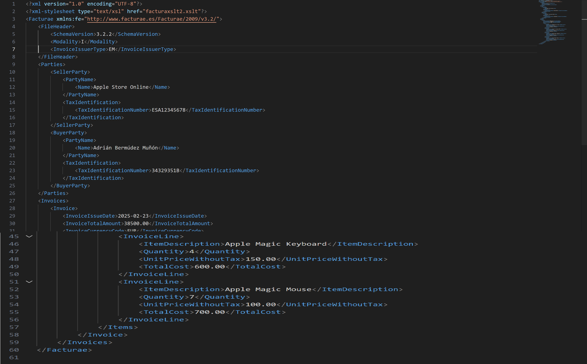
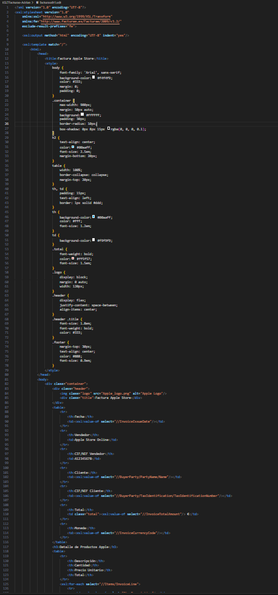
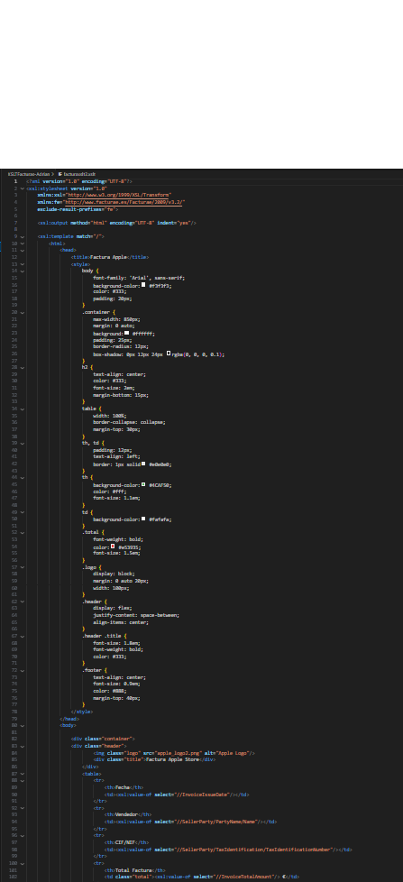

## Plantillas XSLT para FacturaE - Tienda Apple

Este repositorio contiene dos plantillas XSLT diseñadas para transformar archivos XML de facturas en formato **FacturaE** en documentos HTML fácilmente legibles, adaptados para una tienda Apple.

### Archivos

- **facturaxslt1.xslt**: Plantilla con un diseño moderno y tecnológico en tonos oscuros.
- **facturaxslt2.xslt**: Plantilla con un diseño claro y profesional.
- **factura.xml**: Archivo de ejemplo con datos de una factura de productos **Apple**.
- **factura1.html**: Resultado de aplicar `facturaxslt1.xslt` a `factura.xml`.
- **factura2.html**: Resultado de aplicar `facturaxslt2.xslt` a `factura.xml`.

### Descripción de las plantillas XSLT

#### facturaxslt1.xslt

- Diseño moderno y oscuro, ideal para una tienda de tecnología.
- Fondo negro con detalles en azul neón.
- Fuente "Roboto Mono" para un estilo tecnológico y moderno.
- Tablas con bordes resaltados y colores contrastantes.
- Uso de CSS para destacar información clave como precios y totales.

#### facturaxslt2.xslt.

- Diseño claro con colores neutros y estilo profesional.
- Fondo blanco con detalles en azul y gris.
- Fuente "Segoe UI" para una apariencia limpia y elegante.
- Tablas con bordes sutiles y disposición estructurada.
- Secciones bien diferenciadas para mejorar la legibilidad.

### Ejemplo de factura actual

El archivo **factura.xml** contiene una factura de productos **Apple** con los siguientes productos:

- **MacBook Pro 14" M2**: 10 unidades a 2200,00 € cada una.
- **Apple Pro Display XDR**: 3 unidades a 1500,00 € cada una.
- **Apple Magic Keyboard**: 4 unidades a 150,00 € cada una.
- **Apple Magic Mouse**: 7 unidades a 100,00 € cada una.

El total de la factura es **38,500.00 EUR**.

### Cómo usar las plantillas

1. Asegúrate de tener un procesador XSLT compatible, como un navegador moderno o herramientas como `xsltproc`.
2. Abre el archivo `factura.xml` en un editor de texto y enlaza la plantilla deseada con:
    
    ### Se incluyen capturas de pantalla del código fuente y de la web resultante:
    Capturas de  
    Capturas de  
    Capturas de  
